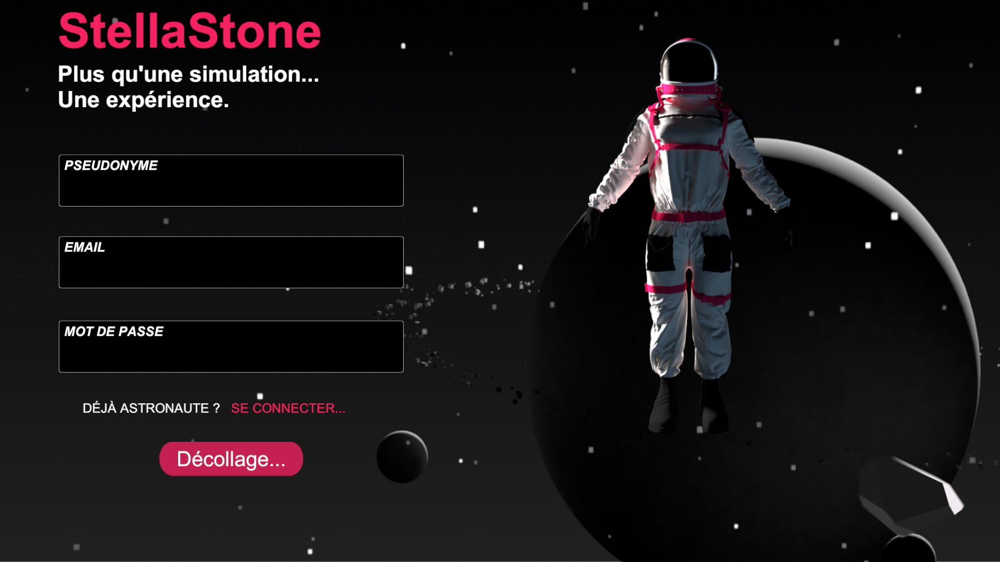
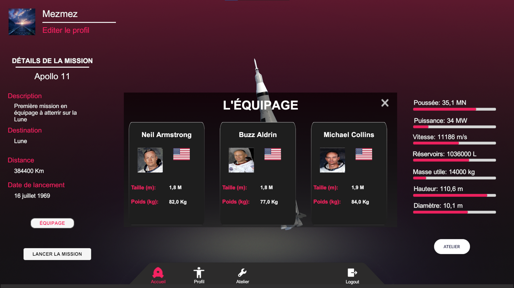
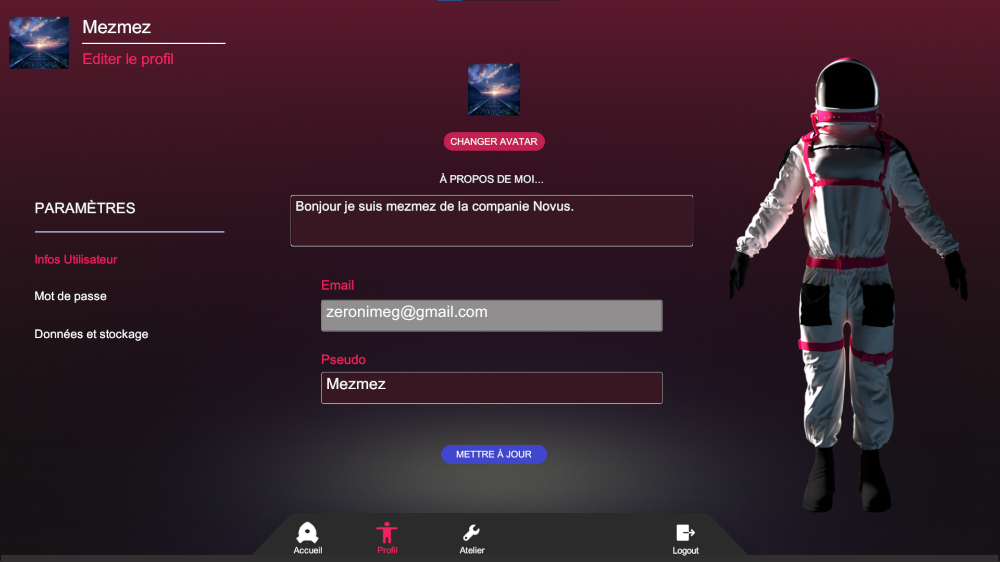
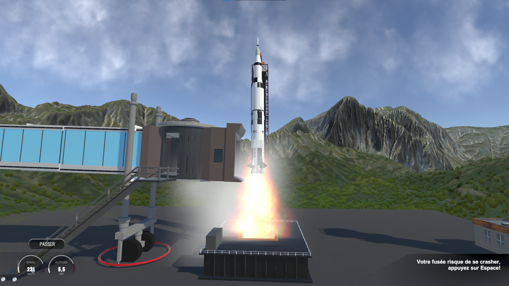
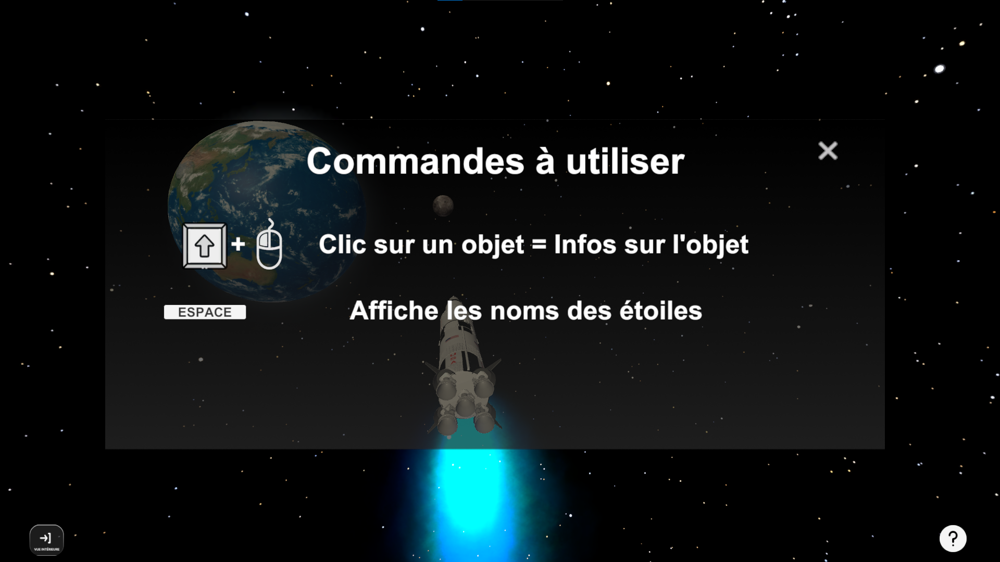
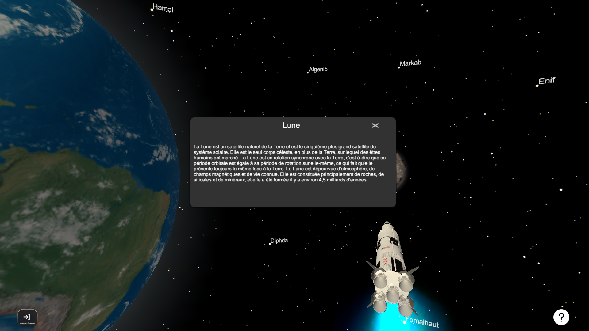
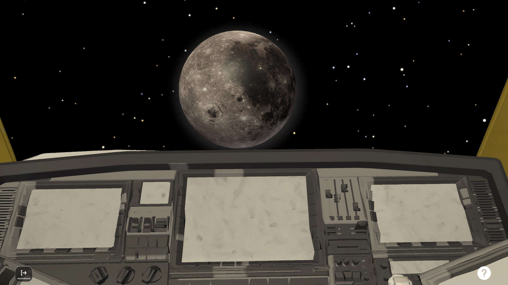
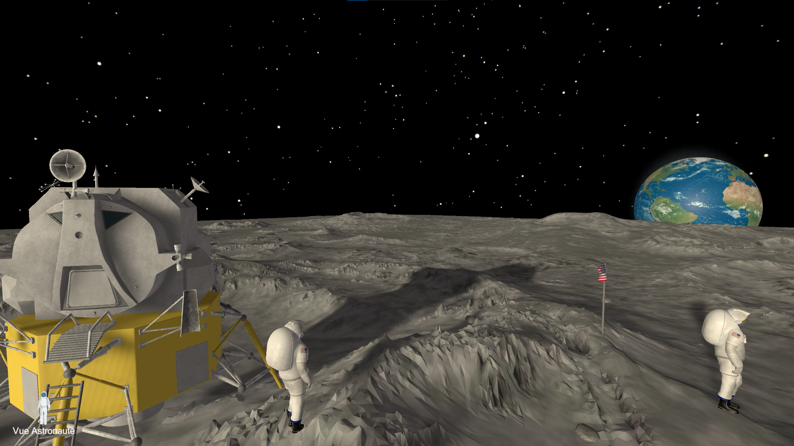
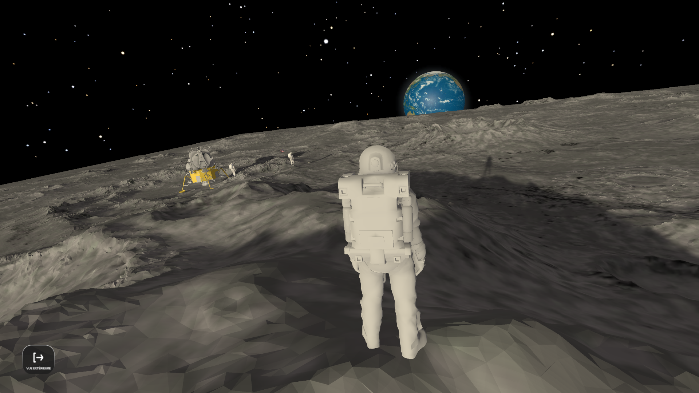
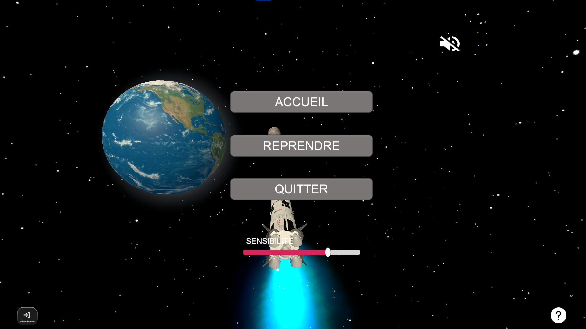

# StellaStone

StellaStone est une application de simulation de voyage spatial réalisée avec Unity. Cette application vous permet de vivre ou de revivre des moments historiques de l'exploration spatiale, tout en découvrant et élargissant vos connaissances sur le domaine spatial.

---

- [Installation](#installation)
- [Fonctionnalités](#fonctionnalités)
  - [AuthScene](#authscene)
  - [HomeScene](#homescene)
  - [ProfilScene](#profilscene)
  - [AtelierScene](#atelierscene)
  - [GameScene](#gamescene)
  - [SpaceScene](#spacescene)
  - [MoonScene](#moonscene)
  - [Fonctionnalités implémentées](#fonctionnalités-implémentées)
  - [Fonctionnalités non implémentées](#fonctionnalités-non-implémentées)
- [Architecture](#architecture)
  - [Architecture du projet](#architecture-du-projet)
- [Documentation](#documentation)

## Installation
- Cloner le dépôt GitHub : git clone https://github.com/zestones/stellastone.git
- Ouvrir le projet dans Unity : ``Unity Hub > Projects > Add > Sélectionner le dossier cloné``
- Charger la scène principale : ``Assets/Scenes/AuthScene.unity``
- Lancer l'application en appuyant sur le bouton Play.

## Fonctionnalités
Le projet StellaStone comporte plusieurs scènes qui permettent de simuler différentes étapes d'un voyage spatial :

### AuthScene
La scène d'authentification permet à l'utilisateur de s'identifier pour accéder aux fonctionnalités du jeu.

L'utilisateur doit entrer son email et son mot de passe pour accéder au jeu. Il peut également créer un nouveau profil en cliquant sur le bouton "Se connecter". Si l'utilisateur n'a pas de profil, il doit créer un nouveau profil avant de pouvoir accéder au jeu.

### HomeScene
La scène d'accueil présente les différentes options de jeu à l'utilisateur. 

L'interface d'accueil va centraliser toute les informations concernant la missions spatial et la fusée. A partir de cette interface, l'utilisateur à accèes à toutes les fonctionnalités du jeu. 

### ProfilScene
La scène de paramètres de profil permet à l'utilisateur de modifier les paramètres de son profil, tels que le nom et l'avatar.

Le profil de l'utilisateur est composé de son nom, de son avatar et de son email. L'utilisateur peut modifier son nom et son avatar en cliquant sur les boutons correspondants.

### AtelierScene
La scène de sélection des fusées permet à l'utilisateur de choisir la fusée qu'il souhaite utiliser pour son voyage spatial. Il peut également consulter les détails de chaque fusée pour faire un choix éclairé.

Cette scene va permettre à l'utilisateur de choisir la mission qu'il souhaite réaliser et la fusée qu'il souhaite utiliser pour sa mission.

### GameScene
La scène de décollage du jeu permet à l'utilisateur de lancer sa fusée et de commencer son voyage spatial. Il doit suivre les instructions pour assurer le succès de sa mission.

### SpaceScene
La scène de voyage dans l'espace permet à l'utilisateur de naviguer dans l'espace. Il peut également consulter les informations sur les différents objets spatiaux qu'il rencontre.

Pour cela un premier pop up informatif vous aidera a connaitre les actions réalisables dans cette scène.

Donc comme préciser en enfonçant la touche **"SHIFT"** vous pourrez bouger votre souris et sélectionner les objets présant dans l'espace pour les inspecter et avoir plus d'informations sur eux.

En apuyant sur le bouton présent en bas à gauche de l'écran vous pourrez changer de vue et accéder à l'interrieur du cockpit de la fusée.

### MoonScene
La scène de découverte de la surface lunaire simule la mission Apollo 11 de la NASA. L'utilisateur doit naviguer sur la surface de la lune et accomplir les tâches nécessaires pour réussir la mission.

vous pourrez sur cette scene également changer de vue en appuyant sur le bouton présent en bas à gauche de l'écran et vous déplacer sur la lune à l'aide des flèches directionnelles et de la souris pour regarder autour de vous. 

Les touches permettant d'inspecter les objets sont les mêmes que dans la scène de voyage dans l'espace.

vous pourrez égalelement accéder à un écran de pause en appuyant sur la touche **"Echap"**. 

Cette ecran de pause est bien entendu disponible dans toutes les scènes du jeu.

### Fonctionnalités implémentées
Les fonctionnalités implémentées dans le projet StellaStone sont :

- Authentification
- Accueil
- Mise en place de l'atelier pour le choix des missions et des fusées
- Décollage de la fusée
- Voyage de la fusée dans l'espace
- Découverte de la surface lunaire lors de la réalisation de la mission Apollo 11 avec Saturn V.

### Fonctionnalités non implémentées
- Mise en place d'un système d'entreprise pour réaliser des missions en collaboration.
- Mise en place d'une carte de la Terre (World Map) pour accéder aux informations de chaque pays sur leur quête spatiale.
- Mise en place d'un voyage en mode aventure où l'utilisateur serait libre de voyager où il le souhaite.

## Architecture
Stellastone est composé d'un premier dossier **documentation** qui contient toutes la documentation du projet. Un second dossier **logiciel** qui celui-ci contient le code source du projet.

### Architecture du projet
Le projet StellaStone est composé de plusieurs dossiers et fichiers. Le dossier Assets contient tous les éléments nécessaires au fonctionnement du jeu. Il est composé de plusieurs sous-dossiers :

- **Assets :** Ce dossier principal contient tous les éléments du jeu, y compris les modèles 3D, les textures, les scripts, l'audio et les prefabs.

- **Assets/Scenes :** Ce dossier contient les scènes individuelles qui composent le jeu.
- **Assets/Scripts :** Ce dossier contient les scripts C# ou UnityScript qui contrôlent le comportement des objets de jeu dans les scènes.
- **Assets/Prefabs :** Ce dossier contient des objets de jeu préfabriqués qui peuvent être réutilisés tout au long du jeu.
- **Assets/Materials :** Ce dossier contient les matériaux utilisés pour la texture des modèles 3D du jeu.
- **Assets/Textures :** Ce dossier contient les textures utilisées pour la texture des modèles 3D du jeu.
- **Assets/Audio :** Ce dossier contient les fichiers audio utilisés dans le jeu.
- **Assets/Models :** Ce dossier contient les modèles 3D utilisés dans le jeu.
- **Assets/Animations :** Ce dossier contient les fichiers d'animation utilisés dans le jeu.
- **Assets/Plugins :** Ce dossier contient les plugins de code natif utilisés dans le jeu.
- **Assets/Resources :** Ce dossier contient des ressources qui peuvent être chargées au moment de l'exécution, telles que des sprites, des textures et des prefabs.
- **Library :** Ce dossier contient les fichiers de métadonnées Unity qui décrivent le projet.
- **ProjectSettings :** Ce dossier contient les fichiers de paramètres utilisés par Unity pour configurer le projet.

## Documentation
La documentation du projet est disponible dans le dossier documentation. Elle comprend entre autre les documents de spécification des exigences, de tests de recettes, de conception, de tests d'intégration et du manuel utilisateur.